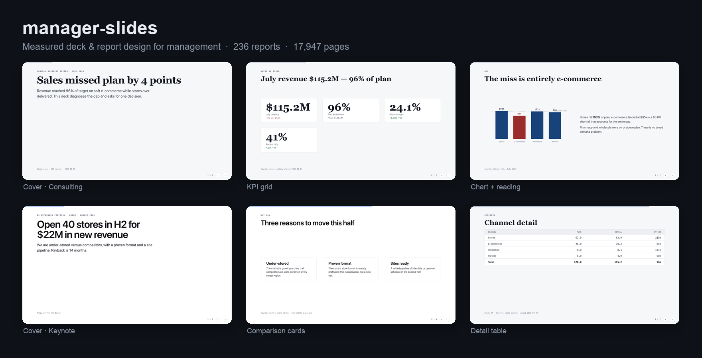
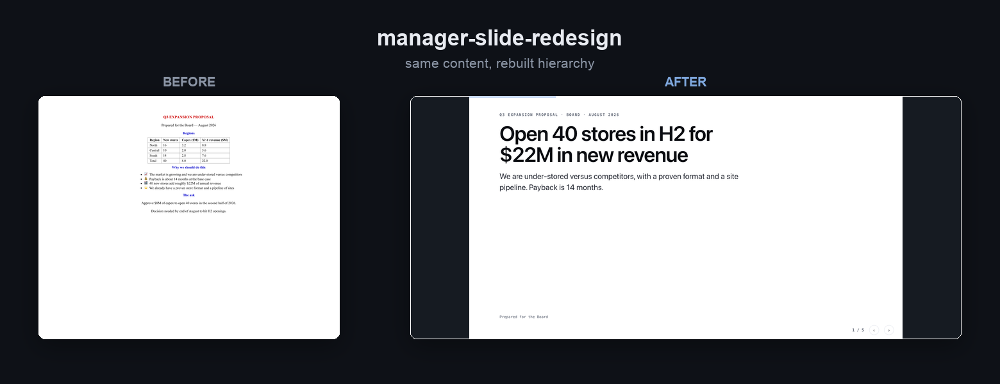

# manager-slides

A Claude Code plugin that builds and redesigns **slide decks and reports for management
audiences** — board, C-level, BU heads, functional leaders. Every design choice is
*measured* from a corpus of **236 real reports (17,947 pages)**, not guessed.



Two skills:

| Skill | Does |
|---|---|
| **`/manager-slide-generate`** | Turn a prompt (plus any attached content, data, or brand guideline) into a designed deck or report. |
| **`/manager-slide-redesign`** | Take an existing deck/report (HTML, PPTX, or pasted) and make it look far better — **keeping the same content**. |

## The one lever

Across the corpus, a single metric separates well-designed reports from the rest:

> **font_scale_ratio** (heading ÷ body) — **1.94** in the design-award group vs **1.16**
> in typical annual reports. A 5.9-sigma gap.

Reports look bad not because they have too much text, but because everything is the same
size. The fix is to **tier** the content, not cut it. Every shell floors the heading/body
ratio at 1.9.

## How it works

1. **Design Read** — the skill classifies audience, purpose, and format in one line.
2. **Elicit only the gaps** — one short question round for what it can't infer. Style is a
   *composite* derived from the Design Read, not a single "make it McKinsey" dropdown.
3. **Look up measured constants** — density, hierarchy, dominant archetypes, and
   chart-title style per audience/purpose.
4. **Build** — map content to page archetypes; render with one of four engines.
5. **Render and self-inspect** — screenshot both themes, look, fix, deliver.

## Redesign: same content, better design

`/manager-slide-redesign` preserves the wording and numbers, then rebuilds hierarchy,
archetype fit, ordering, and color:



## Outputs

- **HTML deck** — 16:9 slides, publishable as an artifact, exported to PDF by
  screenshotting each slide.
- **HTML report** — vertical scroll, shareable, print-to-PDF.
- **Typst** — print-oriented, dense, footnotes and auto-TOC.
- **PPTX** — editable PowerPoint (via the `pptx` skill).

## Styling presets

Three token-only presets (the layout rules never change): **Consulting** (default — tight
grid, navy, tabular), **Editorial** (serif headers, warm neutral), **Keynote** (big type,
high contrast, dark-capable). A user-supplied brand guideline overrides the preset tokens.

## Corpus & sources

The design rules are measured from **236 documents / 17,947 pages** that were collected and
page-tagged. Composition:

| Set | Docs | What |
|---|---:|---|
| S&P 500 filings | 139 | 30 annual reports · 36 earnings decks · 28 investor decks · 45 ESG reports, across 49 companies |
| Startup pitch & strategy decks | 50 | Seed-to-IPO decks studied in public teardowns |
| Institutional & reference reports | 47 | Consulting, public-sector, design-award annual reports, brand guidelines |

**Startup & scale-up decks** — Airbnb · Uber · Dropbox · Coinbase · Snapchat · Shopify ·
Square · Peloton · WeWork · Intercom · Front · Buffer · Mixpanel · N26 · Careem · Oscar ·
Foursquare · Tinder · LinkedIn · YouTube · Facebook · Pendo · Moz · Carta · Crunchbase ·
Wunderlist · Aircall · Alan · Almanac · Castle · Verbit · OpenFin · Rocket Internet ·
Atomwise · ArangoDB · MySQL · and more.

**Consulting & research** — McKinsey Global Institute · BCG · Bain · Deloitte · PwC (CEO
Survey) · Accenture · Stanford AI Index.

**Institutional & public sector** — World Bank (GEP, PAD) · IMF (WEO) · Gates Foundation
(Goalkeepers) · U.S. GAO · U.K. NAO · NASA · NHS board packs.

**Design-award annual reports** — Porsche AG · Sanrio · Titan · Tata Consumer · OMV ·
Austrian Post · Evonik · Garanti BBVA · LTIMindtree · Marui Group · Hindustan Zinc ·
HELLENiQ Energy · s IMMO.

**Brand guidelines** — Adidas · IKEA · LEGO · Spotify.

<details>
<summary><b>Full S&P 500 company list (49)</b></summary>

AbbVie · Adobe · Alphabet · Amazon · American Express · American Tower · Apple ·
Bank of America · BlackRock · Boeing · Broadcom · Caterpillar · Chevron · Coca-Cola ·
Costco · Duke Energy · Eli Lilly · ExxonMobil · GE Aerospace · Goldman Sachs · Home Depot ·
Honeywell · Intel · Johnson & Johnson · JPMorgan Chase · Linde · Lockheed Martin ·
Mastercard · McDonald's · Meta · Microsoft · Morgan Stanley · Nike · Nvidia · PepsiCo ·
Pfizer · Procter & Gamble · Prologis · RTX · Salesforce · Sherwin-Williams · Southern
Company · Tesla · Thermo Fisher · UnitedHealth · Union Pacific · UPS · Visa · Walt Disney

*Reports are the companies' own public filings; company names belong to their respective
owners and are listed here only to document the study corpus.*

</details>

## Layout

```
.claude-plugin/{plugin.json, marketplace.json}
skills/
  manager-slide-generate/SKILL.md
  manager-slide-redesign/SKILL.md
shared/                       # both skills read this
  references/{constants.md, archetypes.md, deck.md}
  styling.md
  assets/{deck.html, report.html, shell.typ}
  scripts/{render.py, deck_to_pdf.py}
examples/                     # rendered proof decks
docs/                         # gallery images
```

## Dependencies

For rendering and self-inspection:

```bash
pip install playwright typst pymupdf pillow
```

Playwright uses the Chrome already on the machine — no `playwright install` needed unless
Chrome is absent.

## Credit

The measured design rules are distilled from the `report-designer` research corpus. The
plugin packaging and the "read the brief, nothing fires automatically" discipline follow
the `taste-skill` architecture.

MIT licensed.
